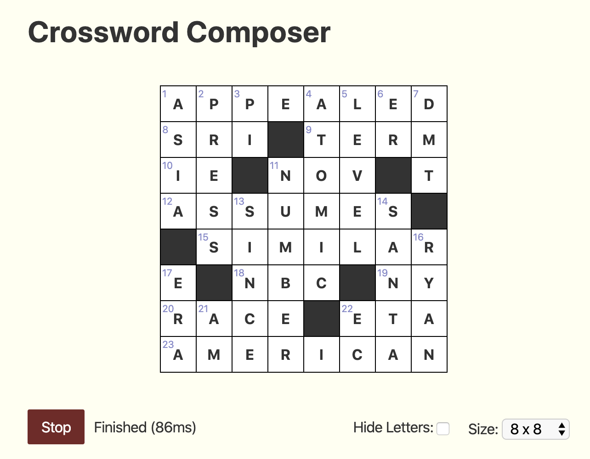
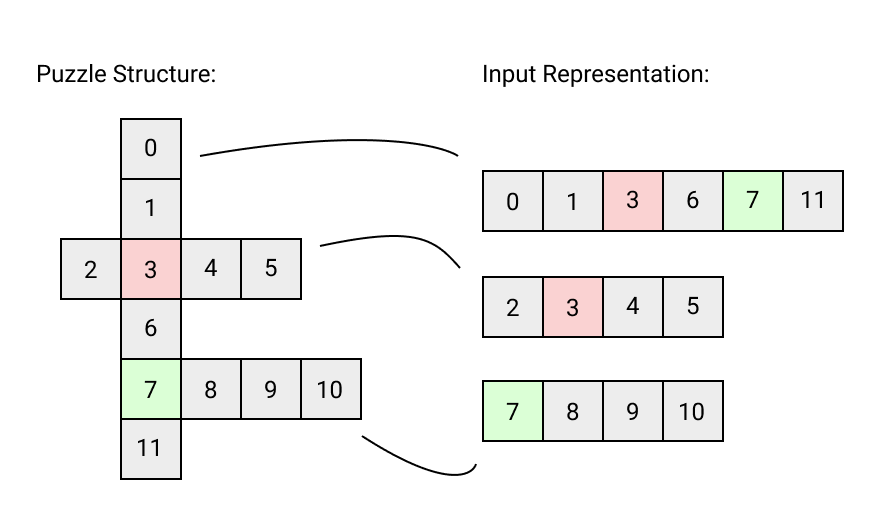
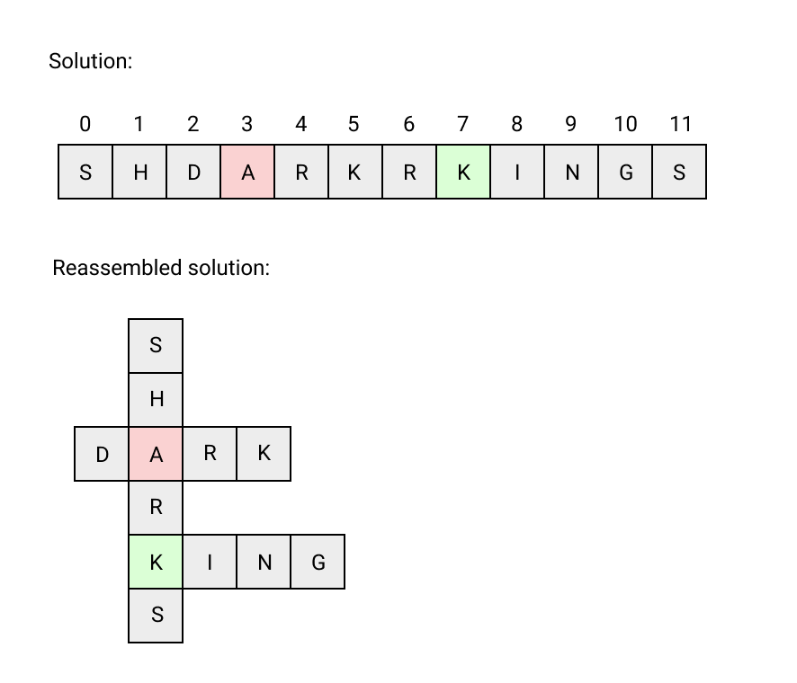

Crossword Composer
==================

Crossword Composer is a browser-based tool for making crossword puzzles. This codebase consists of two main pieces:

- A word puzzle auto-filler (Rust), which finds a set of words that conform to a set of shared-letter constraints.
- A browser-based UI (JavaScript / Svelte), which allows interactive puzzle creation.

Auto-filler
-----------

The auto-filler is written in Rust, and could be used as a standalone library. The auto-filler itself is not aware of the structure of crossword puzzles. It is more akin to a [SAT solver](https://en.wikipedia.org/wiki/Boolean_satisfiability_problem) which takes a problem distilled down to its most basic representation: a list of constraints to be satisfied.

The constraints are provided as a list of lists of numbers. These numbers are identifiers of *slots*: individual letter assignments that the filler must make. Each list of slot identifiers is a *word constraint*: it indicates that the sequence of letters assigned to the slots it refers to (in the given order) **must** correspond to a word in the input dictionary.

The second type of constraint are *letter constraints*. These constraints ensure that the each slot is assigned to exactly one letter. When the same slot is referenced from multiple word constraints, it means that those words share a letter in that position.

If this all seems abstract, let's look at how this applies to a concrete problem. Here's a simple crossword puzzle along with an equivalent input representation. (The colored cells are just a visual aid, they are not part of the representation.)

Put into code, the input representaiton looks like this:

    [
      [0, 1, 3, 6, 7, 11],
      [2, 3, 4, 5],
      [7, 8, 9, 10]
    ]

If we passed the solver these constraints along with a standard English dictionary, a solution it might return is:

    ['S', 'H', 'D', 'A', 'R', 'K', 'I', 'N', 'G', 'S']

The location of each letter corresponds to the numbers in the puzzle structure diagram above, and can be reassembled into a solution as shown below.

*Note that the actual numbers assigned doen't really matter for the purposes of the representation. For example if we swap 5 and 7 everywhere they appear we have an equally valid representation of the puzzle.*

The filler uses a standard backtracking approach: for each word constraint, it arbitrarily picks a word from the dictionary that satisfies the slots already assigned. Whenever there are no words in the dictionary that work, it reverses its most recent word assignments until it gets back to a step where it has more available words to try. It then proceeds from there with a different (but again arbitrary) word choice.

The filler speeds up this process in two ways:

1. It attempts to pick a good order to solve the word constraints in. The basic idea is that when we are on a dead-end route, we want to know as soon as possible that no solution will work so that we can backtrack without wasting time. Note that once we know the order in which we will solve the word constraints, we also know which slots will be known and which will be unknown by the time we solve it. The heuristic for picking an order is a simple greedy algorithm: first we take the longest word constraint, then we continually take the word constraint with the highest number of slots that overlap with previously picked word constraints (breaking ties by length, preferring the longest).
2. For each word constraint, we create an in-memory index. This index provides a fast mapping *from* values of the slots that will be assigned by the time we visit that word constraint, *to* all possible values of the unassigned slots in the word constraint that result in a valid (in-dictionary) word. One way to think of these indexes is as a sort of permuted dictionary. If you have an alphabetically-sorted dictionary, and you want to fill in the blanks in the word `sp___`, it's a fast operation. But if you want to fill in the word `_p__n`, it's slow -- you have to scan the whole dictionary! If you are planning to solve a lot of `_#__#` fill-in-the-blanks, as we are, it is worthwhile to create a whole new dictionary where you permute the words so that the known letters appear at the beginning (e.g. `spoon` becomes `pnsoo`). Luckly, once we have pre-determine our order, the blanks for each word *will* always be in the same spot for any given word constraint. So we create one of these indexes for each word constraint.

Once those tasks are completed, we begin filling. At this point, we can even throw away the dictionary we were given as input, since the indexes we built for each word contain all the vocabulary information we need.

Browser UI
----------

The browser UI is a JavaScript tool for designing crossword grids. It imports the solver using WebAssembly and uses it to fill the puzzle.

The `Solver` class manages the interface between the UI and the auto-filler from the JavaScript side. Filling the crossword is computationally intensive, so we don't want to run it in the main JavaScript thread (which would lock up the UI and prevent modifying the grid while the solver is running). Instead, the `Solver` class manages a [Web Worker](https://developer.mozilla.org/en-US/docs/Web/API/Web_Workers_API/Using_web_workers) which runs the filler in another thread.

When the filler is turned on, every subsequent edit to the grid causes the `Solver` to terminate the existing web worker (if one exists), spawn a new one, load the auto-filler as a WebAssembly module, and start filling the new grid. Unfortunately, terminating the entire web worker is the only way to interrupt that thread, so for every change to the grid we incur the overhead of spawning a new instance of the WebAssembly module. Fortunately, WebAssembly is purpose-built for this kind of fast start. In practice, the time to fill a puzzle is dominated by the backtracking process, so the cost of constantly starting new workers is negligible.

The `Solver` class is also responsible for caching the web worker script, dictionary file, and WebAssembly module binary. Otherwise, network round-trips would need to be made for each of these every time the user changed the grid.

See Also
--------

- [Qxw](https://www.quinapalus.com/qxw.html) and [Crux](https://www.quinapalus.com/crux.html) are open-source word game creation tools. Although my filler uses a different solving approach (I think?), the constraint specification approach I took was inspired by reading its documentation.
- [Steven Morse](https://stmorse.github.io/journal/IP-Crossword-puzzles.html) has written about using integer programming to solve crosswords. Although I didn't take this approach, it was a helpful read.
- [Phil](http://www.keiranking.com/phil/) ([GitHub repo](https://github.com/keiranking/Phil)) is a more fully-featured HTML crossword creator. Its creators also took the approach of running a filler in the browser with WebAssembly.